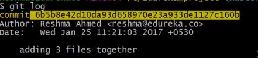

## Git and Github

#### Resources
* [Corey Schafer](https://www.youtube.com/watch?v=HVsySz-h9r4)
* [Edureka](https://www.youtube.com/watch?v=xuB1Id2Wxak&t=2859s)

#### Definition

#### Distributed Version Control System -  

  

Advantages of DVCS-

* Backup
* Access to files without a network
* Fetching to workspace is no problem

#### Git Commands and Operations

* Configuration
  * **git --version** - gives the current version of git installed
  * **git config --global user.name "Aniruddha019"** - Configuring username
  * **git config --global user.email "aniruddha019@gmail.com"** - Configuring email
  * **git config --list** - To list all configuration values
  * **git help <verb>** or **git <verb> --help** - Documentation for git command  

* Create Repo
  * **git init** - Initialize git local repository. This will      create a .git folder with all the necessary objects.
  * Place all files for git to ignore in .gitignore file. Can use wildcard characters.
* Sync Repo  
 

   * **git remote add origin ["repository_link"]** - syncs local repository with central repository.
   * **git clone [url] .** - Clones remote repo to local repo
   * **git pull origin master** - pulls the content of central repo to the local repo.

   (_faced issues first time_: fatal error - protocol 'https' not supported. restarting the bash worked)
   * **git push origin [branch_name]** - Pushing files from local to remote repository
   * **git remote -v** - Lists information about remote Repo.
   * **git branch -a** - Lists all branches remotely.

* Making Changes
  * **git status** - used to view and keep track of indexed/staged and non-staged files. Also keeps track of modified files.
  * **git add** - stages the files selected in the index for commit.
 Options -
    * (-A for commiting all files)
  * **git reset** - Removes everything from Staging area
  * **git commit** - commiting files into the local repo. Cannot commit without message
 Options -
    * -a for commiting all files
    * -m for message
  * **git log** - log of all commands and Operations  
   

* Parallel Development  
 Branches are pointers to a specific commit. Branches are of 2 types - local and remote

   * **git branch [branch_name]** (while in master) - This will create a new branch from master named branch_name
   * **git checkout [branch_name]**
   * **git merge [branch_name]** (while in master) - This will merge branch_name to master
   
   * **git rebase [branch_name]** (while in master) - it will attach the branch_name to tip of master in a linear workflow.  
   

* Generating Keys
  * **ssh-keygen** - generates ssh Keys
  * **ssh -T git@github.com** - Authenticates ssh key  
